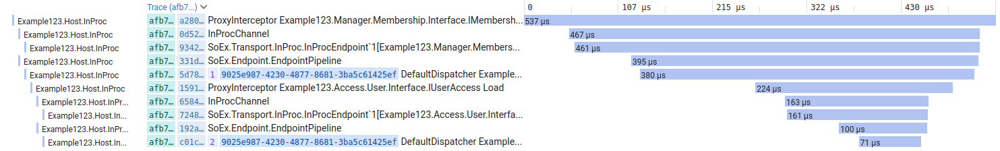

# Tutorial

[[toc]]


::: info
For simplicity we are going to use some helpers that follow the conventions of the IDesign Method, you can learn more about
that by reading [Righting Software](https://www.amazon.com/dp/0136524036). For an example hosting a
service with your own naming see
[HowTo: Host your first inproc service](howto.html#host-your-first-inproc-service)
:::

## Create a service oriented project and host it with SoEx

::: tip
This requires the method.solution and method.component templates. [HowTo: Setup Templates](howto.html#setup-templates)
:::

 ### Create a solution

The first step is to create a solution, this template includes a default Host and default glue to
connect everything together. The glue layers also called "iFx" is where you can update your own choices
of telemetry, logging, or conventions without having to alter either SoEx or your business code.

 ```bash
 dotnet new method.solution -n Example123 -o Example123
 ```

### Create manager interface and service projects

```bash
cd Example123
dotnet new method.component -n Example123 --componentType Manager --componentName Membership
```
Add them to the solution

```bash
dotnet sln add Component/*/*/Interface/
dotnet sln add Component/*/*/Service/
```

Reference the service from the Host

```bash
dotnet reference add Component/*/*/Service/ --project Host/InProc/Example123.Host.InProc.csproj
```

In the directory: `Component/Manager/Membership/Interface`. Create the interface file: `IMembershipManager.cs`

```c#
namespace Example123.Manager.Membership.Interface
{
    public interface IMembershipManager
    {
        Task Profile();
    }
}
```

::: tip
If this part feels a bit manual don't worry. When working on a real system and not following a tutorial, you can automate
the creation of Interfaces and the referencing of projects by using [MethodSketch](https://methodsketch.app)
:::

In the directory: `Component/Manager/Membership/Service`. create the implementation for the service inside file: `MembershipManager.cs`

```c#
namespace Example123.Manager.Membership.Service
{
    public class MembershipManager : IMembershipManager
    {
        public Task Profile()
        {
            return Task.CompletedTask;
        }
    }
}
```

### Call the Manager service
In the file: Example123/Host/InProc/Program.cs

Change
```c#
// var proxy = Proxy.ForService<I_XXX_Manager>();
// await proxy._Operation_();
throw new NotImplementedException();
```

to

```c#
var proxy = Proxy.ForService<IMembershipManager>();
await proxy.Profile();
```

Set a breakpoint inside the manager implementation and hit debug!

### Create an access

Next we are going to create a UserAccess for the manger to retrieve the profile

```bash
dotnet new method.component -n Example123 --componentType Access --componentName User
```
Add them to the solution

```bash
dotnet sln add Component/*/*/Interface/
dotnet sln add Component/*/*/Service/
```

Reference the service from the Host

```bash
dotnet reference add Component/*/*/Service/ --project Host/InProc/Example123.Host.InProc.csproj
```

Reference the access interface from the manager
```bash
dotnet reference add Component/Access/User/Interface/ --project Component/Manager/Membership/Service/Example123.Manager.Membership.Service.csproj
```

In the directory: `Component/Access/User/Interface`. Create the interface file: `IUserAccess.cs`

```c#
namespace Example123.Access.User.Interface
{
    public interface IUserAccess
    {
        Task Load();
    }
}
```

In the directory: `Component/User/Access/Service`. create the implementation for the service inside file: `UserAccess.cs`

```c#
namespace Example123.Access.User.Service
{
    public class UserAccess : IUserAccess
    {
        public Task Load()
        {
            return Task.CompletedTask;
        }
    }
}
```

### Call the access from the manager

#### Using DI

We will start with obtaining the proxy by dependency injection as that is what most people are familiar with.

Update `MembershipManager.cs`

```c#
public class MembershipManager(IUserAccess userProxy) : IMembershipManager
{
    public async Task Profile()
    {
        await userProxy.Load();
    }
}
```

set a breakpoint in the UserAccess and hit debug!


#### Proxy Helper

Instead of littering the constructor that is used by every single operation, we can use the proxy helper.

Update `MembershipManager.cs`

```c#
public class MembershipManager : IMembershipManager
{
    public async Task Profile()
    {
        var userProxy = Proxy.ForComponent<IUserAccess>(this);
        await userProxy.Load();
    }
}
```

Hit debug and check all your breakpoints are hit.


It is likely that part of the audience is new to
[service-orientation](explanation#service-disambiguation) and is screaming at me that this is a service locator and the
[Service Locator is an anti-pattern](https://blog.ploeh.dk/2010/02/03/ServiceLocatorisanAnti-Pattern/).
All the examples of this being an anti-pattern are connected to [object-orientation](explanation#service-disambiguation).

First we are requesting a Proxy to the service and not the service itself. Second we do not know if the service we
are connecting to is:
* in process
* out of process
* over a network
* on the same machine,
* is a single instance or a cluster of multiple instances

The proxy is going to take an address and using some mechanism of discovery locate the endpoint.
Then use the endpoint information to open a channel to communicate with the service.

Regardless of if you acquire your proxy from a static helper or the constructor, the same registration is invoked

```c#
builder.Register(c => c.Resolve<ProxyFactory>().Create(client.Service.Contract)).As(client.Service.Contract);
```

The ProxyFactory returns you a proxy that has no target behind it, instead the invocation is going to he handled
by an interceptor

```c#
public object Create(Type serviceInterface)
{
    return s_proxyGenerator.CreateInterfaceProxyWithoutTarget(serviceInterface, _proxyInterceptor);
}
```

The interceptor does alot of work beyond the scope of this tutorial: Retrieving the client to get the binding,
creating the channel and following the ChannelPipeline


::: info
Every invocation in SoEx is per call so anything added for another operation will be built and discard on
every single call. Dependency injection is best reserved for the object-oriented implementation within your service.
When communicating between services it is your choice, but the author of the framework thinks its cleaner and
more understandable to just use the helper and not be dogmatic.
:::

## Logging and tracing

Now lets look at the built in logs and traces. You can either install [Seq](https://datalust.co/) or update
methods `ConfigureTelemetry()` and `ConfigureLogging()` in file `iFx/Observability/ObservabilityExtensions.cs` to use your favourite tool.

Once you have logging setup lets run the project again. Start up and first run is always a bit slower, to keep
image a bit smaller this screenshot is from a second request.




To get your traces look the same as the example in Seq, add a new signal called SoEx and paste the following over the Columns definition


```js
"Columns": [
    {
      "Expression": "@TraceId"
    },
    {
      "Expression": "hostAssemblyName"
    },
    {
      "Expression": "@SpanId"
    },
    {
      "Expression": "HopCount"
    },
    {
      "Expression": "CallChainId"
    }
  ]
```


## Ambient Context

On the dispatcher trace you may observe that there is a number and a guid. If you expand the entry you will see these
are properties called HopCount and CallChainId. These are included mostly for the benefit of providing an example.

Take a look in the file `Common\Policy\ContextFlowPolicy.cs`.

The incoming method creates or passes on Contexts down the calls. The outgoing method allows contexts to be flowed back
to the caller. The reason for doing this by Policy is to allow control over how the context is flowed and prevent
arbitary contexts from being added and polluting the system.

An example of a common context would be the AuthContext where the identity of the user would be copied from the
ClaimsPrincipal in the HttpContext into the AuthContext. Then when you load the the user from the database you might have
a CustomerContext or PartnerContext that holds the internal id in the system for whole the caller is. This means you don't
need to include the identity of the active caller in everything single data contract in your system. You can read it from
the context. Keeping the DTOs cleaner and eliminating the ability to accidentally transpose it.

The last method ScopeProperties() allows you to return a dictionary of keys and values that will be added to the properties
of the traces and logs. This means that at every dispatcher hop and for every error or informational log this information
will be available in addition to the explicit content of the log message.


## Swapping to another binding

Now we will create two hosts and a client that communicate over a binding called NamedPipe. (This uses a socket on non-windows systems)
```bash


dotnet new console --use-program-main -n Membership.Example123.Manager.Membership.Host -o Host/PerComponent/Membership/Membership/
dotnet new console --use-program-main -n Membership.Example123.Access.User.Host -o Host/PerComponent/Membership/User/
dotnet new console --use-program-main -n Example123.PerComponent.Client -o Test/Client/PerComponent/
dotnet sln add Host/PerComponent/Membership/Membership/
dotnet sln add Host/PerComponent/Membership/User/
dotnet sln add Test/Client/PerComponent/

dotnet reference add Component/Manager/Membership/Service/ --project Host/PerComponent/Membership/Membership/Membership.Example123.Manager.Membership.Host.csproj
dotnet reference add iFx/Hosting/Component --project Host/PerComponent/Membership/Membership/Membership.Example123.Manager.Membership.Host.csproj
dotnet reference add Common/Policy/ --project Host/PerComponent/Membership/Membership/Membership.Example123.Manager.Membership.Host.csproj
dotnet reference add Component/Access/User/Service/ --project Host/PerComponent/Membership/User/Membership.Example123.Access.User.Host.csproj
dotnet reference add iFx/Hosting/Component --project Host/PerComponent/Membership/User/Membership.Example123.Access.User.Host.csproj
dotnet reference add Common/Policy/ --project Host/PerComponent/Membership/User/Membership.Example123.Access.User.Host.csproj
dotnet reference add Component/Manager/Membership/Interface/ --project Test/Client/PerComponent/Example123.PerComponent.Client.csproj
dotnet reference add Common/Policy/ --project Test/Client/PerComponent/Example123.PerComponent.Client.csproj
dotnet reference add iFx/Client/ --project Test/Client/PerComponent/Example123.PerComponent.Client.csproj
dotnet reference add iFx/Convention --project Test/Client/PerComponent/Example123.PerComponent.Client.csproj
dotnet reference add iFx/Observability --project Test/Client/PerComponent/Example123.PerComponent.Client.csproj
dotnet add package SoEx.Transport.NamedPipe --version 0.0.0-alpha-2.1 --project Test/Client/PerComponent/Example123.PerComponent.Client.csproj
dotnet add package SoEx.Hosting --version 0.0.0-alpha-2.1 --project Test/Client/PerComponent/Example123.PerComponent.Client.csproj
```

Update both Component hosts `Program.cs` to be.

```c#
using Microsoft.Extensions.Hosting;

class Program
{
    static async Task Main(string[] args)
    {
        var builder = Example123.iFx.Hosting.Component.Host.NamedPipe(args);
        await builder.RunAsync();
    }
}
```

Update the component client `Program.cs`

```c#
using Autofac;
using Example123.iFx.Client;
using Example123.iFx.Convention;
using Example123.iFx.Hosting.Test;
using Example123.iFx.Observability;
using Example123.Manager.Membership.Interface;
using Microsoft.Extensions.DependencyInjection;
using Microsoft.Extensions.Hosting;
using SoEx;
using SoEx.Context;
using SoEx.Hosting;
using SoEx.Transport.NamedPipe;
using Proxy = Example123.iFx.Proxy.Proxy;


var clientBuilder = new ClientBuilder();
clientBuilder.AddClientFor<IMembershipManager>(typeof(NamedPipeBinding<>),"Membership");


var hostBuilder = Host.CreateApplicationBuilder(args);
hostBuilder.SoEx(clientBuilder.Build());

hostBuilder.Services.NamedPipedClient();
hostBuilder.Services.ConfigureLogging();
hostBuilder.Services.ConfigureTelemetry();
var policyTypes = Scan.ContextPolicyTypes("Example123");
foreach (var policyType in policyTypes)
{
    hostBuilder.Services.AddTransient(typeof(IContextFlowPolicy), policyType);
}
hostBuilder.AddTestClient(TestClient, shutdownWhenCompleted: true);

await hostBuilder.Build().RunAsync();


static async Task TestClient(ILifetimeScope lifetimeScope)
{
    System.Diagnostics.Debugger.Break();
    using (var requestScope = lifetimeScope.BeginLifetimeScopeAsyncLocal())
    {
        IMembershipManager membershipManager = Proxy.ForService<IMembershipManager>();
        await membershipManager.Profile();
    }
    await Task.Delay(1000);
}

```

Then configure all the projects within PerComponent to run together and start debugging.

Now when viewing the trace in Seq you can see that everything takes longer and happens across processes.

### Explaining the Client

The client is a little verbose so that we can explain how this could be added to an existing project such as a WebApi
in order to connect an operation on the API to service.

```c#
hostBuilder.SoEx(clientBuilder.Build());
```

The Toplogy.System with only clients will add registrations for hte services interfaces that return clients that will
communicate using the choosen binding.

```c#
hostBuilder.Services.NamedPipedClient();
```

Registers the channel that provides the communication for the binding.

```c#
hostBuilder.Services.AddTransient(typeof(IContextFlowPolicy), policyType);
```

If you would like policy to begin from the client call make sure to register the policy

```c#
hostBuilder.AddTestClient(TestClient, shutdownWhenCompleted: true);
```

This line is not required if you have a real application

```c#
using (var requestScope = lifetimeScope.BeginLifetimeScopeAsyncLocal())
```

This creates a request scope for the operation, if you are using something like MVC or WebApi this will already
be created automatically before your controller code is reached.

## Testing and Mocking

Utilizing two class you can invoke your classes in a test harness that will communicate using the
InProcBinding and UnsafeThreadChannel transports

`SoEx.Test.ServiceRunner` will allows access a proxy to the service/component

`SoEx.Test.TestEnvironmentBase` allows configuration of the test environment hosting the components


```bash
dotnet new nunit -n Test.Unit.MembershipManager -o Test/Unit/Membership
dotnet sln add Test/Unit/Membership
dotnet add package Moq --project Test/Unit/Membership/Test.Unit.MembershipManager.csproj
dotnet add package SoEx.Test --version 0.0.0-alpha-2.1 --project Test/Unit/Membership/Test.Unit.MembershipManager.csproj
dotnet add package SoEx.Method.Conventions --version 0.0.0-alpha-2.1 --project Test/Unit/Membership/Test.Unit.MembershipManager.csproj
dotnet reference add Component/Manager/Membership/Service/ --project Test/Unit/Membership/Test.Unit.MembershipManager.csproj
dotnet reference add Component/Access/User/Service/ --project Test/Unit/Membership/Test.Unit.MembershipManager.csproj
dotnet reference add Common/Policy --project Test/Unit/Membership/Test.Unit.MembershipManager.csproj
```


Create the class `UnitTestEnvironment` in the folder `Test/Unit/Membership/`
```c#
using SoEx.Test;

namespace Test.Unit.Membership
{
    public class UnitTestEnvironment : TestEnvironmentBase
    {

    }
}
```


Create the class `MembershipManagerTests` in the folder `Test/Unit/Membership/`

```c#
using Example123.Access.User.Interface;
using Example123.Access.User.Service;
using Example123.Common.Policy;
using Example123.Manager.Membership.Interface;
using Example123.Manager.Membership.Service;
using Moq;
using SoEx.Test;
using SoEx.Topology;
using SoEx.Transport.InProc;

namespace Test.Unit.Membership;

public class MembershipManagerTests
{
    UnitTestEnvironment harness = new UnitTestEnvironment();

    public MembershipManagerTests()
    {
        harness.DefaultPolicies([typeof(ContextFlowPolicy)]);
    }

    [Test]
    public async Task Test_With_Real_Implemenations()
    {
        var topology = new SoEx.Topology.System()
        {
            SubSystems =
            [
                new SubSystem()
                {
                    Name = "Membership",
                    EntryPoint = new Host()
                    {
                        Implementation = typeof(MembershipManager),
                        Endpoints = [new InProcBinding<IMembershipManager>("Membership")],
                        Proxies =
                        [
                            new SoEx.Topology.Client<IUserAccess>()
                            {
                                Service = new InProcBinding<IUserAccess>("Membership"),
                                SubSystem = "Membership"
                            }
                        ]
                    },
                    Components = [
                        new Host()
                        {
                            Implementation = typeof(UserAccess),
                            Endpoints = [new InProcBinding<IUserAccess>("Membership")],
                            Proxies = []
                        },
                    ]
                }
            ],
            Clients = [
                new SoEx.Topology.Client<IMembershipManager>()
                {
                    Service = new InProcBinding<IMembershipManager>("Membership"),
                    SubSystem = "Membership"
                }
            ]
        };

        var serviceRunner = ServiceRunner.Create<IMembershipManager>(async proxy =>
        {
            await proxy.Profile();
        });
        await harness.TestService(serviceRunner, topology);
    }

    [Test]
    public async Task Test_With_MockedAccess()
    {
        var accessMock = new Mock<IUserAccess>();
        accessMock.Setup(x => x.Load())
            .Returns(() =>
                Task.CompletedTask
                );

        var topology = new SoEx.Topology.System()
        {
            SubSystems =
            [
                new SubSystem()
                {
                    Name = "Membership",
                    EntryPoint = new Host()
                    {
                        Implementation = typeof(MembershipManager),
                        Endpoints = [new InProcBinding<IMembershipManager>("Membership")],
                        Proxies =
                        [
                            new SoEx.Topology.Client<IUserAccess>()
                            {
                                Service = new InProcBinding<IUserAccess>("Membership"),
                                SubSystem = "Membership"
                            }
                        ]
                    },
                    Components = [
                        new HostMock()
                        {
                            Instance =  accessMock.Object,
                            Implementation = typeof(Mock),
                            Endpoints = [new InProcBinding<IUserAccess>("Membership")],
                            Proxies = []
                        },
                    ]
                }
            ],
            Clients = [
                new SoEx.Topology.Client<IMembershipManager>()
                {
                    Service = new InProcBinding<IMembershipManager>("Membership"),
                    SubSystem = "Membership"
                }
            ]
        };

        var serviceRunner = ServiceRunner.Create<IMembershipManager>(async proxy =>
        {
            await proxy.Profile();
        });
        await harness.TestService(serviceRunner, topology);
    }

    [Test]
    public async Task Test_Access_Component()
    {
        var topology = new SoEx.Topology.System()
        {
            SubSystems =
            [
                new SubSystem()
                {
                    Name = "Membership",
                    EntryPoint = new Host()
                    {
                        Implementation = typeof(MembershipManager),
                        Endpoints = [],
                        Proxies = []
                    },
                    Components = [
                        new Host()
                        {
                            Implementation = typeof(UserAccess),
                            Endpoints = [new InProcBinding<IUserAccess>("Membership")],
                            Proxies = []
                        },
                    ]
                }
            ],
            Clients = [
                new SoEx.Topology.Client<IMembershipManager>()
                {
                    Service = new InProcBinding<IMembershipManager>("Membership"),
                    SubSystem = "Membership"
                }
            ]
        };

        var serviceRunner = ServiceRunner.Create<IUserAccess>(async proxy =>
        {
            await proxy.Load();
        });
        await harness.TestComponent(serviceRunner, topology);
    }
}
```

It is possible to simplify the tests by specifying a default configuration in the test harness

```c#
 harness.DefaultConfiguration(SystemTopology);
```

To keep things explicit in this example the topology is defined in each test.
